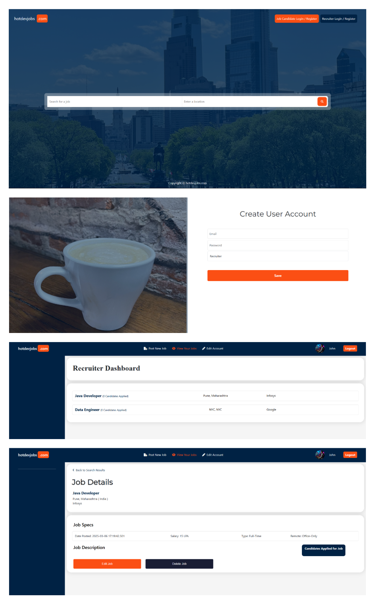

# Job Portal Application

## Overview

The **Job Portal Application** is a backend system built using **Java Spring Boot**, **Hibernate**, **Spring MVC**, and **Thymeleaf**. It allows job seekers to apply for jobs, and employers to post job opportunities. The application supports user authentication and also authorization.

## Technologies Used

- Java 11+
- Spring Boot
- Hibernate
- Spring MVC
- Spring Security
- Thymeleaf
- PostgreSQL (or any relational DB)

## Features

- **User Roles**: Job Seekers and Recruiters.
- **Authentication & Authorization**: Managed via Spring Security.
- **Job Management**: Recruiters can post, update, and delete job posts; Job Seekers can apply for jobs or save the job.
- **Responsive UI**: Rendered with Thymeleaf templates.

## Setup

1. Clone the repository and navigate to the project directory.
2. Configure your database connection in the `application.properties` file.
3. Build the application using Maven or your preferred build tool.
4. Run the application and access it on `http://localhost:8080`.

## Running Tests

Run unit and integration tests with Maven using the `mvn test` command.

## Contributing

Feel free to fork the repository, create a new branch, and submit a pull request.

## License

This project is licensed under the MIT License.

---

**Acknowledgements**:  
Thanks to Spring Boot, Hibernate, and Thymeleaf for the tools that power this project.
